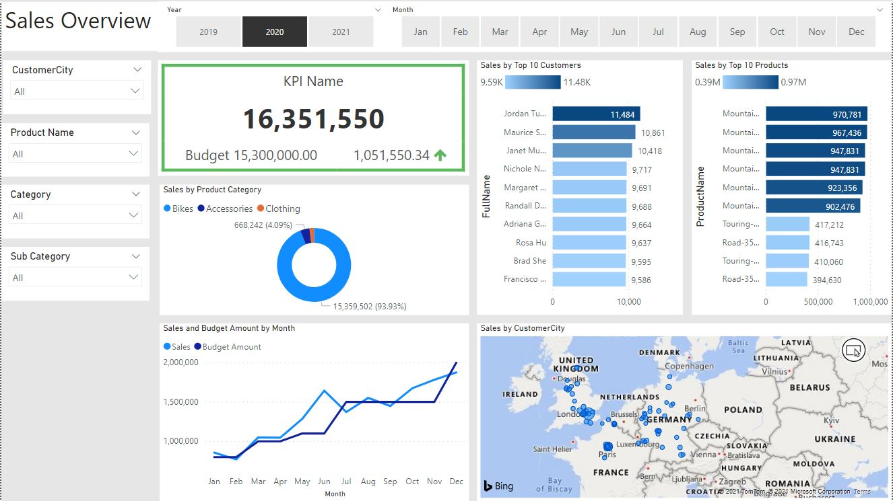
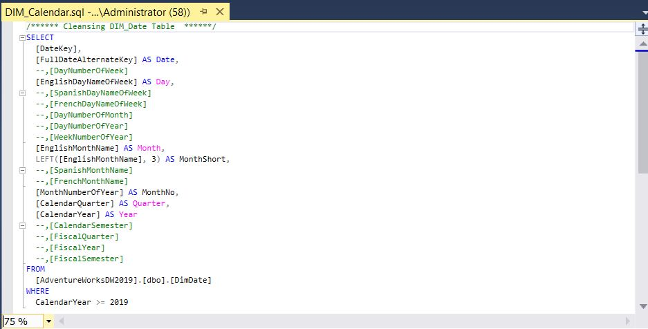
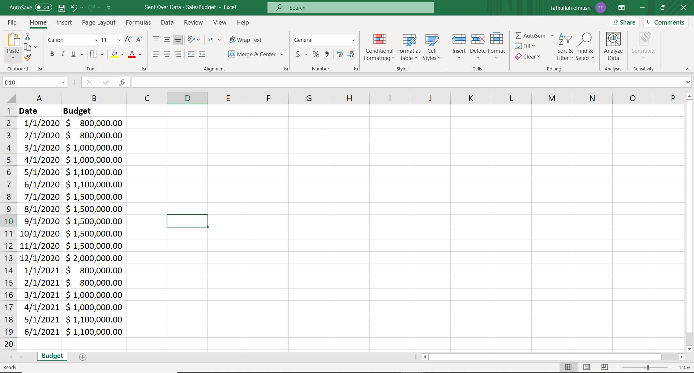
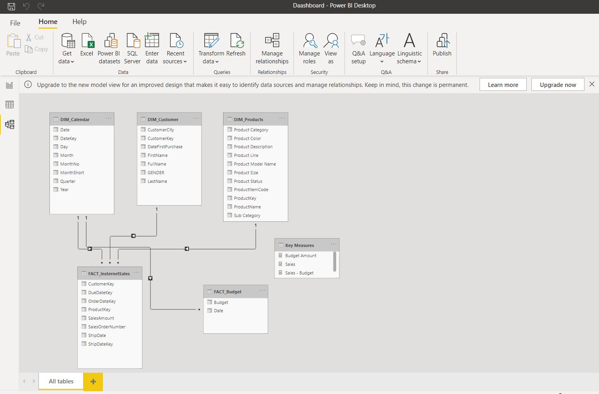
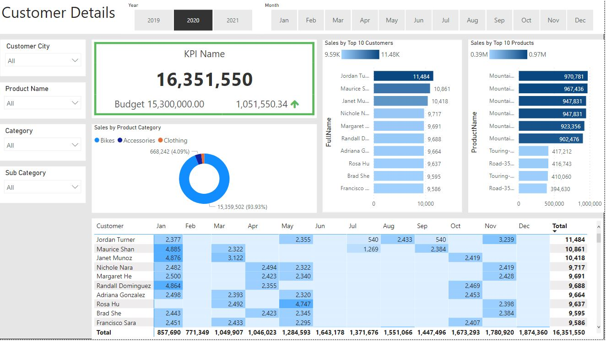

# Data Analyst Project - Sales Management






## Business Request & User Stories

An executive sales report for sales managers was the business request for this data analyst project. Following user stories were designed to complete delivery and guarantee that acceptance criteria were met throughout the project, based on the request from the company.

| No # | As a (role) | I want (Request/Demand) | So that (User Value) | Acceptance criteria |
| ----------- | ----------- | ----------- | ----------- | ----------- |
| 1 | Sales Manager | To get dashboard overview of internet sales | Can follow better which customers and products sell the best | A power BI dashboard which updates data once a day |
| 2 | Sales Representative |A detailed overview of internet sales per customer |Can follow up my customers that buys the most and who can sell more to |A power Bi dashboard which allows me to filter data for each customer |
| 3 | Sales Representative |A detailed overview of internet sales per product |Can follow up my products that sell the most |A power Bi dashboard which allows me to filter data for each product |
| 4 | Sales Manager |To get dashboard overview of internet sales |Follow Sales over time against budget |A power Bi dashboard with graphs and KPI’s comparing against budget |

## Data Cleansing & Transformation (SQL)
The following tables were retrieved using SQL to generate the appropriate data model for doing analysis and meeting the business needs indicated in the user stories.

One data source (sales budgets) was provided in Excel format and was afterwards integrated in the data model.

The SQL statements for cleansing and converting the data are listed below.
`code`
### DIM_Calendar Table
```
/****** Cleansing DIM_Calendar Table  ******/
SELECT 
  [DateKey], 
  [FullDateAlternateKey] AS Date, 
  --,[DayNumberOfWeek]
  [EnglishDayNameOfWeek] AS Day, 
  --,[SpanishDayNameOfWeek]
  --,[FrenchDayNameOfWeek]
  --,[DayNumberOfMonth]
  --,[DayNumberOfYear]
  --,[WeekNumberOfYear]
  [EnglishMonthName] AS Month, 
  LEFT([EnglishMonthName], 3) AS MonthShort, 
  --,[SpanishMonthName]
  --,[FrenchMonthName]
  [MonthNumberOfYear] AS MonthNo, 
  [CalendarQuarter] AS Quarter, 
  [CalendarYear] AS Year 
  --,[CalendarSemester]
  --,[FiscalQuarter]
  --,[FiscalYear]
  --,[FiscalSemester]
FROM 
  [AdventureWorksDW2019].[dbo].[DimDate] 
WHERE 
  CalendarYear >= 2019
```

### DIM_Customer Table
```
/****** Cleansed DIM_Customers Table  ******/
SELECT 
  c.[CustomerKey] AS CustomerKey, 
  --,[GeographyKey]
  --,[CustomerAlternateKey]
  --,[Title]
  c.[FirstName], 
  --,[MiddleName]
  c.[LastName], 
  c.[FirstName]+' '+c.[LastName] AS [FullName],
  --,[NameStyle]
  --,[BirthDate]
  --,[MaritalStatus]
  --,[Suffix]
  CASE c.[Gender] WHEN 'M' THEN 'MALE' WHEN 'F' THEN 'FEMALE' END AS Gender, 
  --,[EmailAddress]
  -- ,[YearlyIncome]
  --,[TotalChildren]
  --,[NumberChildrenAtHome]
  --,[EnglishEducation]
  --,[SpanishEducation]
  --,[FrenchEducation]
  --,[EnglishOccupation]
  --,[SpanishOccupation]
  --,[FrenchOccupation]
  --,[HouseOwnerFlag]
  --,[NumberCarsOwned]
  --,[AddressLine1]
  --,[AddressLine2]
  --,[Phone]
  c.[DateFirstPurchase] AS DateFirstPurchase, 
  --,[CommuteDistance]
  g.City AS [CustomerCity] 
FROM 
  [AdventureWorksDW2019].[dbo].[DimCustomer] AS c 
  LEFT JOIN [AdventureWorksDW2019].[dbo].[DimGeography] AS g on g.GeographyKey = c.GeographyKey 
ORDER BY 
  CustomerKey ASC -- Order List by Customer Key

```

### DIM_PRoducts Table
```
/****** Cleansed DIM_Products Table  ******/
SELECT 
  p.[ProductKey], 
  p.[ProductAlternateKey] AS ProductItemCode, 
  -- [ProductSubcategoryKey]
  --,[WeightUnitMeasureCode]
  --,[SizeUnitMeasureCode]
  [EnglishProductName] AS [ProductName], 
  ps.EnglishProductSubcategoryName AS [Sub Category], 
  -- Joined in from Sub-Category Table
  pc.EnglishProductCategoryName AS [Product Category], 
  -- Joined in from Category Table
  --[SpanishProductName]
  --,[FrenchProductName]
  --,[StandardCost]
  --,[FinishedGoodsFlag]
  p.Color AS [Product Color], 
  --,[SafetyStockLevel]
  --,[ReorderPoint]
  --,[ListPrice]
  p.Size AS [Product Size], 
  --,[SizeRange]
  --,[Weight]
  --,[DaysToManufacture]
  p.ProductLine AS [Product Line], 
  --,[DealerPrice]
  --,[Class]
  --,[Style]
  p.ModelName AS [Product Model Name], 
  --,[LargePhoto]
  p.[EnglishDescription] AS [Product Description], 
  --,[FrenchDescription]
  --,[ChineseDescription]
  --,[ArabicDescription]
  --,[HebrewDescription]
  --,[ThaiDescription]
  --,[GermanDescription]
  --,[JapaneseDescription]
  --,[TurkishDescription]
  --,[StartDate]
  --,[EndDate]
  ISNULL (p.Status, 'Outdated') AS [Product Status] 
FROM 
  [AdventureWorksDW2019].[dbo].[DimProduct] AS p 
  LEFT JOIN [AdventureWorksDW2019].[dbo].[DimProductSubcategory] AS ps ON ps.ProductSubcategoryKey = p.ProductSubcategoryKey 
  LEFT JOIN [AdventureWorksDW2019].[dbo].[DimProductCategory] AS pc ON ps.ProductCategoryKey = pc.ProductCategoryKey 
ORDER BY 
  p.ProductKey ASC

```

### FACT_InternetSales Table
```
/****** Cleansing FACT_InternetSales Table  ******/
SELECT 
  [ProductKey], 
  [OrderDateKey], 
  [DueDateKey], 
  [ShipDateKey], 
  [CustomerKey], 
  -- ,[PromotionKey]
  -- ,[CurrencyKey]
  -- ,[SalesTerritoryKey]
  [SalesOrderNumber], 
  -- ,[SalesOrderLineNumber]
  -- ,[RevisionNumber]
  -- ,[OrderQuantity]
  -- ,[UnitPrice]
  -- ,[ExtendedAmount]
  -- ,[UnitPriceDiscountPct]
  -- ,[DiscountAmount]
  -- ,[ProductStandardCost]
  -- ,[TotalProductCost] 
  [SalesAmount],
  -- ,[TaxAmt]
  -- ,[Freight]
  -- ,[CarrierTrackingNumber]
  -- ,[CustomerPONumber]
  --  ,[OrderDate]
  -- ,[DueDate] 
  [ShipDate] 
FROM 
  [AdventureWorksDW2019].[dbo].[FactInternetSales] 
WHERE 
  LEFT (OrderDateKey, 4) >= YEAR(GETDATE()) - 2      -- Ensures that we always only bring 2 years of date from extraction
ORDER BY 
  OrderDateKey ASC


```
## Data Model
The data model after the cleansed and reformatted tables were read into Power BI is shown below.

This data architecture also demonstrates how FACT_Budget is linked to FACT_InternetSales and other DIM tables.


## Sales Management Dashboard

The completed sales management dashboard includes one page that serves as a dashboard and overview, as well as one more pages that combine tables for important details and visualizations to illustrate sales over time, by customers, and by items.



